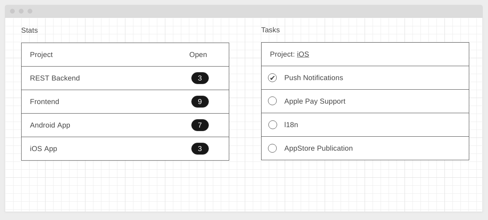
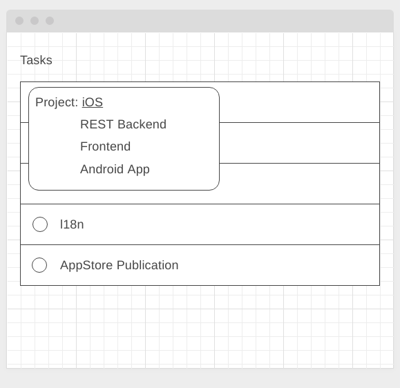

#### Deployment: <a href="">Github Pages</a>

---

## Project Management Dashboard

### Легенда

Вы делаете рабочее место менеджера проектов, который может отслеживать как задачи по конкретному проекту, так и общую статистику по проектам.

В вашу задачу входит реализация двух виджетов:
1. Виджет статистики открытых задач по каждому проекту
1. Виджет просмотра задач

### Описание

Реализуйте на базе State Management общее состояние приложение, где задачи хранятся в стейт-менеджере, а виджеты получают `Store` через конструктор, подписываясь на состояние.

Как это должно выглядеть:



Для выбора проекта:



Все данные храните в памяти (серверная часть не нужна). Для хранения используйте следующую структуру:

```javascript
{
  "projects": [
    ...,
    {
      "id": 4,
      "name": "iOS App",
      "tasks": [
        {
          "id": 25,
          "name": "Push Notifications",
          "done": true
        },
        {
          "id": 26,
          "name": "Apple Pay Support",
          "done": false
        },
        ...
      ]
    }
  ]
}

```

При завершении задач (установка флажка) в правом виджете, количество открытых задач в левом виджете должно автоматически обновляться. То же касается снятия флажка.

Обратите внимание: виджеты не должны ничего знать друг о друге и должны быть способны функционировать отдельно.
